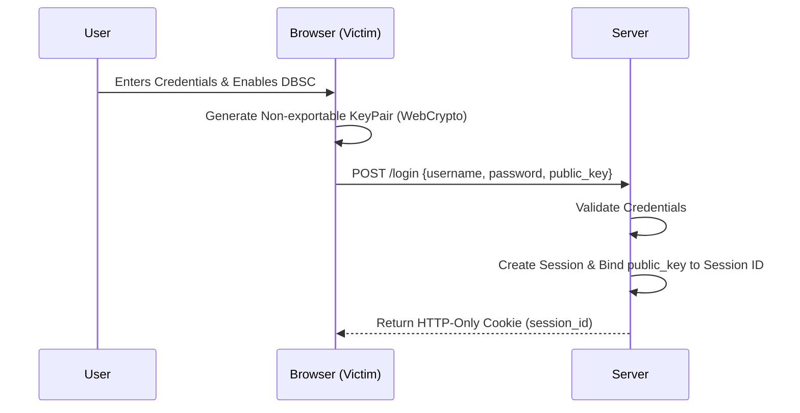
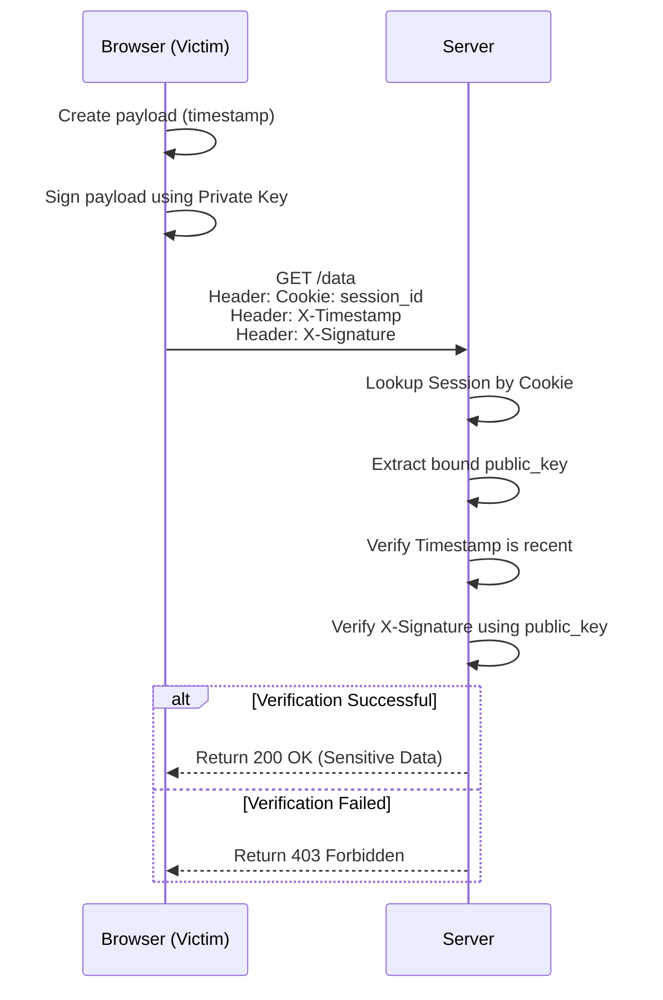
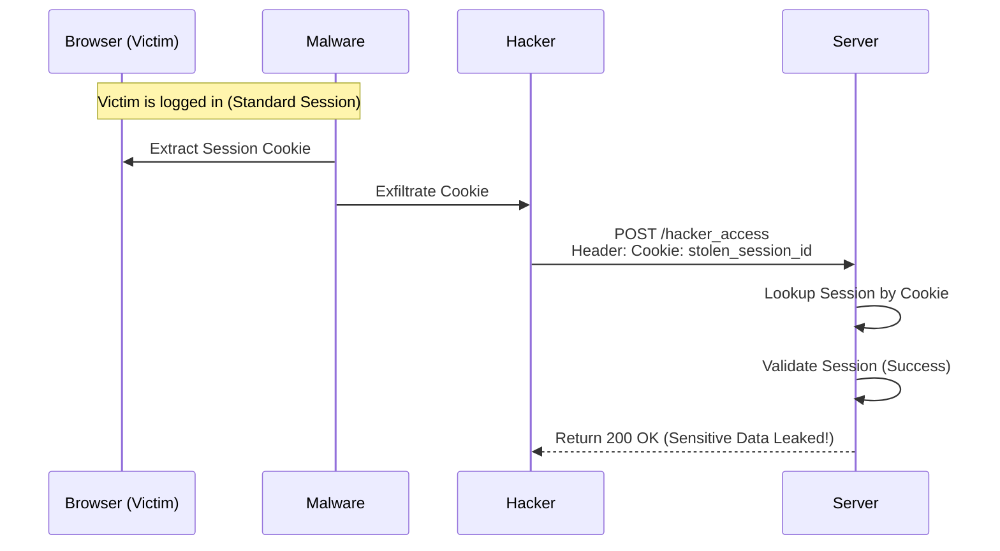
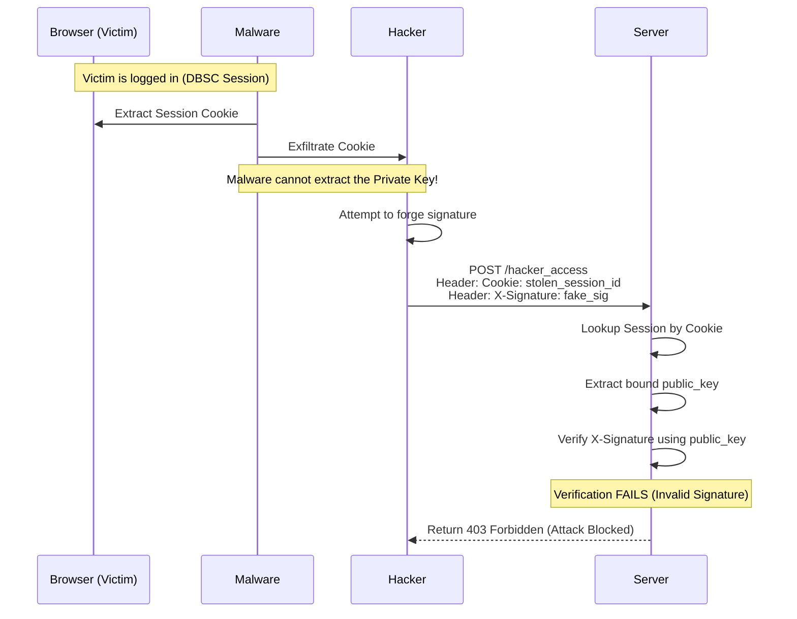

# Architecture & Data Flow

This document outlines the flows demonstrated in the DBSC demo application.

## 1. Authentication Flow (DBSC Enabled)

When DBSC is enabled, the login process requires the client device to generate a cryptographic key pair and register the public key with the server.

## 2. Authenticated Data Request (DBSC Enabled)

Every subsequent request must include a cryptographic signature generated by the private key, proving the request originates from the bound device.

## 3. Cookie Theft & Replay Attack (Standard Cookie)

If DBSC is NOT enabled, the server only requires the cookie. If the cookie is stolen, the attacker has full access.

## 4. Failed Replay Attack (DBSC Enabled)

When DBSC is enabled, stealing the cookie is insufficient. The attacker cannot steal the hardware-bound private key.

